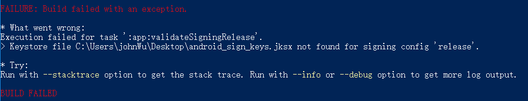
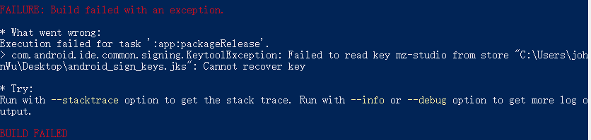

## 打包输出 android apk【debug 版】
步骤一：打包所需要的资源生成 bundle 包
> react-native bundle --entry-file index.js --platform android --dev false --bundle-output ./android/app/src/main/assets/index.android.bundle --assets-dest ./android/app/src/main/res/

步骤二：执行生成测试包
> cd android
> ./gradlew assembleDebug
> ./gradlew assembleRelease
--------

## 打包输入 android apk【release 版本】
### 步骤一: 在Android studio中生成签名文件


### 步骤二：在 android/app/build.gradle 文件中添加
```javascript
signingConfigs {
    release {
        storeFile file("C:/Users/johnWu/Desktop/android_sign_keys.jks")
        keyAlias "mz-studio"
        keyPassword "123123"
        storePassword "123123"
    }
}

buildTypes {
    release {
        ...
        //此句为新添加
        signingConfig signingConfigs.release
    }
}
```

### 第三步：在下项目根目录下执行
> react-native bundle --entry-file index.js --platform android --dev false --bundle-output ./android/app/src/main/assets/index.android.bundle --assets-dest ./android/app/src/main/res/

### 第四步：进入 android 目录，然后执行 ./assembleRelease
> cd android
> ./gradlew assembleRelease
-------

## 错误解决办法：

### 签名打包项目时出现Error： Could not read path 'D:/...' 
> 问题原因：错误是由于react-native init 初始化项目时有部分文件丢失造成的
> 解决办法：删除 node_modules 目录，改用 npm install 来执行


### 签名打包项目时出现Error：Keystore file C:\yourKeyName.jksx not found for signing config 'release'.
> 问题原因：Keystore 路径有问题，检查配置文件路径是否正确
> 解决办法：确保配置正确


### 签名打包项目时出现Error： Failed to read key mz-studio from store "C:\yourKeyName.jks": Cannot recover key
> 问题原因：store 或 alias 或密码出现错误
> 解决办法：确保配置正确




